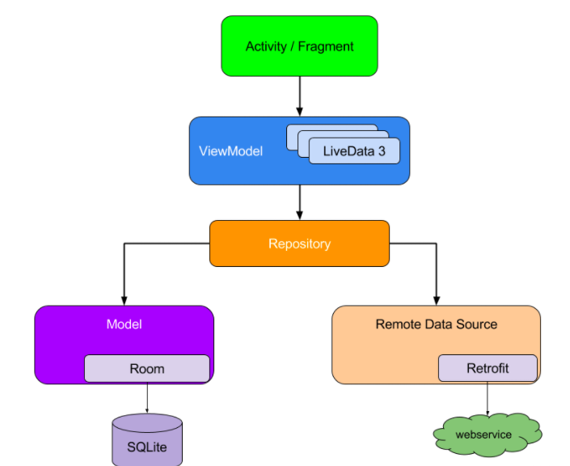

# MVVMScaffoldKt
使用kotlin语言，配合jetpack系列库搭建的MVVM框架。  
主要使用到的技术点、三方库有：Flow、Retrofit、Hilt、Room、Navigation、DataBinding、LiveData、Moshi等。

整体分为6个模块
- core-base：封装基础类，baseActivity、baseFragment、util等
- core-network:封装retrofit、网络相关类
- core-repository：存放repository
- core-database:存放数据库相关类
- core-model：存放业务Beans类
- app：业务实现模块

## 模块、依赖管理
使用buildSrc统一管理模块，各模块Android配置信息相同，均使用Configuration文件中所配置的。  
各模块依赖方面也采取了统一版本管理，各三方库的配置信息在gradle/libs.versions.toml中。

## core-base介绍
提供了BaseVmActivity、BaseVmDbActivity、BaseVmVbActivity可根据具体的情况选择使用。  
Notice：Vm = ViewModel、Vb = ViewBinding、Db = DataBinding

### BaseVmActivity
使用时传入ViewModel泛型即可，会自动创建ViewModel，内部使用mViewModel即可；  
内部还创建了UiLoadingChange的监听，在ViewModel中触发UiChange会调用showToast和showLoading。  

### BaseVmDbActivity、BaseVmVbActivity
都是继承自BaseVmActivity，会自动绑定DataBinding和ViewBinding。
另外也提供了BaseVmFragment、BaseVmVbFragment、BaseVmDbFragment功能类似。

### Dialog
dialog也提供了基类，需实现dialogSize返回dialog的宽高。其中：  
- BaseSimpleDialog:适用于不需要viewmodel，只显示内容和处理简单点击事件的dialog
- BaseVmVbDialog:使用ViewBinding和ViewModel的dialog，适用于处理有复杂业务逻辑的dialog

## core-network介绍
封装retrofit、网络相关类。  
使用时需要在service/NetworkService类中声明接口方法，NetworkClient调用，
使用Hilt注入NetworkClient到相应的Repository中。    
另外添加了LogInterceptor(TAG = HttpLog)方便调试。

## core-database介绍
使用room管理数据库。
使用方法：  
- 1.创建Entity
- 2.创建Dao
- 3.在DatabaseModule中添加providerDao方法
- 4.使用处@Inject即可

## MVVM介绍
本框架是严格按照谷歌官方给出的MVVM架构图设计的。    
  
编写代码时应遵循以下原则：  
- 通过网络、数据库返回的都是数据Flow，在repository中对数据进行相应的处理，最后流到ViewModel中。    
- ViewModel通过collect或asLiveData对流进行收集处理
- UI层通过监听LiveData对页面进行处理
- 反之亦然，事件触发 -> viewModel -> repository -> source  

### ForExample

Activity:  
```kotlin
        mViewModel.articleInfoData.observe(this){
            adapter.submitList(it)
        }
```

ViewModel:  
```kotlin
val articleInfoData = homeRepository.getArticles(
    onStart = { loadingChange.showLoading.postValue(true) },
    onComplete = { loadingChange.showLoading.postValue(false) },
    onError = { loadingChange.showToast.postValue("请求出错") }).asLiveData()
```

Repository:
```kotlin
class HomeRepositoryImpl @Inject constructor(
    private val networkClient: NetworkClient,
    private val articleDataDao: ArticleDataDao
) : HomeRepository {

    override fun getArticles(
        onStart: () -> Unit,
        onComplete: () -> Unit,
        onError: () -> Unit
    ): Flow<List<ArticleData>> =
        flow {
            val list = articleDataDao.getAllData()
            if (list.isNotEmpty()){
                Timber.d("data from db!")
                emit(list)
            }else{
                val articleInfo = networkClient.getArticles().getResult()
                emit(articleInfo.datas)
            }
        }.catch { exception ->
            onError.invoke()
            Timber.e(exception.message)
        }
            .onStart { onStart.invoke() }
            .onCompletion { onComplete.invoke() }
            .flowOn(Dispatchers.IO)
}
```

Source:
```kotlin

class NetworkClient @Inject constructor(private val networkService: NetworkService){
    suspend fun getArticles():BaseResponse<ArticleInfo> = networkService.getArticlesList()
}

@Dao
interface ArticleDataDao {
    @Query("select * from ArticleData")
    suspend fun getAllData() : List<ArticleData>

    @Insert(onConflict = OnConflictStrategy.REPLACE)
    suspend fun insert(articleData: List<ArticleData>)

    @Update
    suspend fun update( articleData: ArticleData)
}

```

以上即为一次完整的数据流向。

## 事件
全局事件可以用eventViewModel，该ViewModel是APP级别的；  
相同的还有appViewModel，里面存放了一些账户信息，基本配置信息等。

### 关于LiveData
事件的分发监听使用LiveData，观察者模式符合条件。但原生的livedata是默认粘性事件设计（监听者会观察到注册之前的数据），所以使用了一个三分库UnPeekLiveData。  
该livedata特点：
- 1.非粘性事件；
- 2.一条消息能被多个观察者消费；
- 3.默认只会观察最新的消息。

建议不用过度使用全局事件，容易造成后期维护难的情况。（一条消息能被多个观察者消费，耦合严重）

## 其他
后续会慢慢完善该框架，欢迎学习交流。


